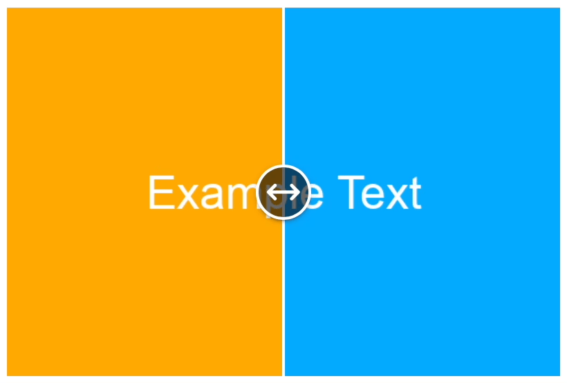

# svelte-compare-image [](https://www.npmjs.com/package/svelte-compare-image)

A Svelte component to compare two images with a slider to reveal one over the other.
Find the package on NPM at [svelte-compare-image](https://npmjs.com/package/svelte-compare-image).

An interactive example can be found at https://projects.brianm.me/svelte-compare-image/

This component is CI tested against Svelte 4, but should work with Svelte 3 as well.



Changes are run inside of `requestAnimationFrame` to improve performance and reduce lag.

## Docs

The component will display the images and fill available width and height the aspect ratios of the first image.

To use it, render the component as seen below, providing image src and alt text for the left and right images.
The following CSS custom properties are optional and can be set to customize the appearance of the slider.

### Props

| Property                    | Default Value        |
| --------------------------- | -------------------- |
| `--handle-size`             | `2.5rem`             |
| `--handle-background-color` | `rgba(0, 0, 0, 0.6)` |
| `--handle-background-image` | _see below_          |
| `--handle-border-width`     | `0.125rem`           |
| `--slider-color`            | `#ffffff`            |
| `--slider-width`            | `0.125rem`           |

Default thumb background image:

```css
url('data:image/svg+xml;utf8,<svg viewBox="0 0 24 24" xmlns="http://www.w3.org/2000/svg"><path d="M3 12H21M3 12L7 8M3 12L7 16M21 12L17 16M21 12L17 8" stroke="white" stroke-width="2" stroke-linecap="round" stroke-linejoin="round"/></svg>')
```

It looks like this (shown with `darkgray` for viewing here, it is white in the component)


### Slots

`CompareImage` has one named slot, `slider-label`, which is used to label the
slider control. It is displayed in a visually hidden `span`. The default value
is the following:

> Set the visibility of one image over the other. 0 is full visibility of
> the second image and 100 is full visibility of the first image. Any
> amount in-between is a left/right cutoff at the percentage of the
> slider.

## Example

```svelte
<script lang="ts">
  import { CompareImage } from "svelte-compare-image";
  // or
  import CompareImage from "svelte-compare-image/CompareImage.svelte";

  // too many quotes to deal with, storing as a variable is easier
  const handleBackgroundImage = `url('data:image/svg+xml;utf8,<svg viewBox="0 0 24 24" xmlns="http://www.w3.org/2000/svg"><path d="M3 12H21M3 12L7 8M3 12L7 16M21 12L17 16M21 12L17 8" stroke="white" stroke-width="2" stroke-linecap="round" stroke-linejoin="round"/></svg>')`;
</script>

<CompareImage
  imageLeftSrc="https://via.placeholder.com/600x400/ffaa00/ffffff/?text=Example+Text"
  imageLeftAlt="left"
  imageRightSrc="https://via.placeholder.com/600x400/00aaff/ffffff?text=Example+Text"
  imageRightAlt="right"
  --handle-size="2.5rem"
  --handle-background-color="rgba(0, 0, 0, 0.6)"
  --handle-background-image={handleBackgroundImage}
  --handle-border-width="0.125rem"
  --slider-color="#ffffff"
  --slider-width="0.125rem"
>
  <svelte:fragment slot="slider-label">
    Set the visibility of one image over the other. 0 is full visibility of the
    second image and 100 is full visibility of the first image. Any amount
    in-between is a left/right cutoff at the percentage of the slider.
  </svelte:fragment>
</CompareImage>
```
